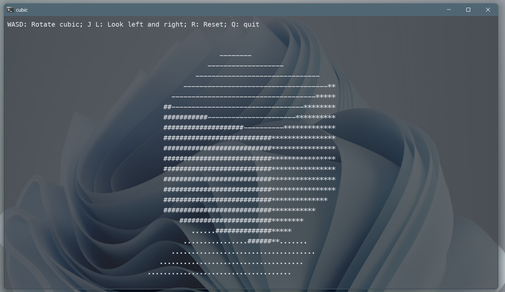

# Cubic: ASCII Cubic in your terminal



Own a cubic that can rotate and have shadow in your own terminal!

## Dependencies

- Eigen3
- ncurses

## Install and Run

```bash
git clone "https://github.com/MicRev/cubic.git"
cd cubic
mkdir build && cd build
cmake ..
make -j8
./cubic
```

## Usage and Feature

Press `wasd` to rotate the cubic. Press `j` and `l` to rotate your viewing direction. Press `r` to reset and `q` to quit. The frames and asciis are rendered in-time.

## Future Plans

Rotating your viewing direction upwards and downwards are currently not supported because bug exists. When rotated to near straight up or down directions, the rotation becomes strange. The bug is sheduled to be fixed in the future and we will appreciate it so much if you have any ideas about the bug and are willing to share it with us.